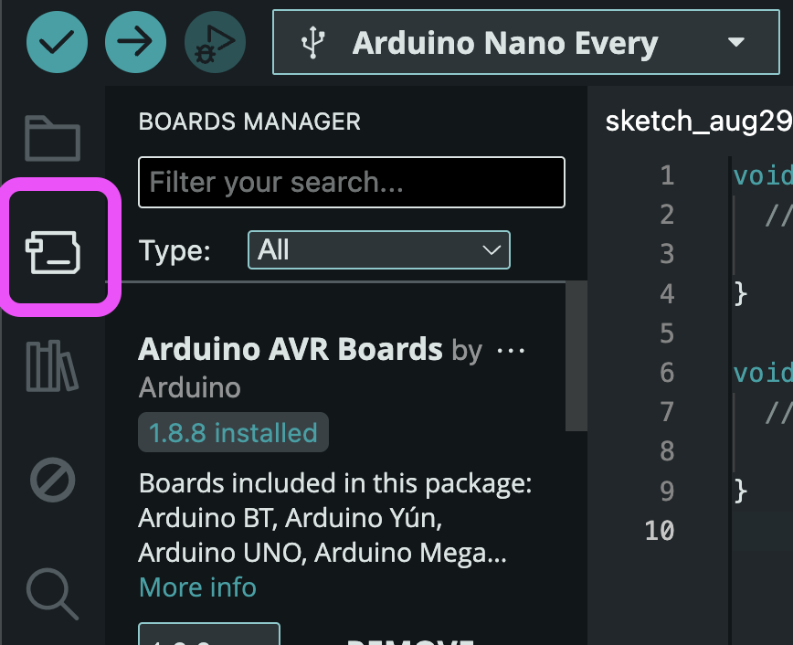
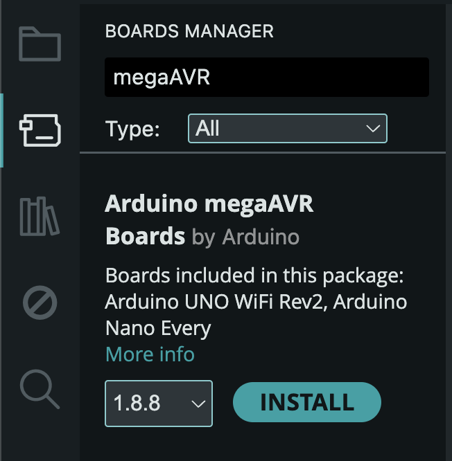
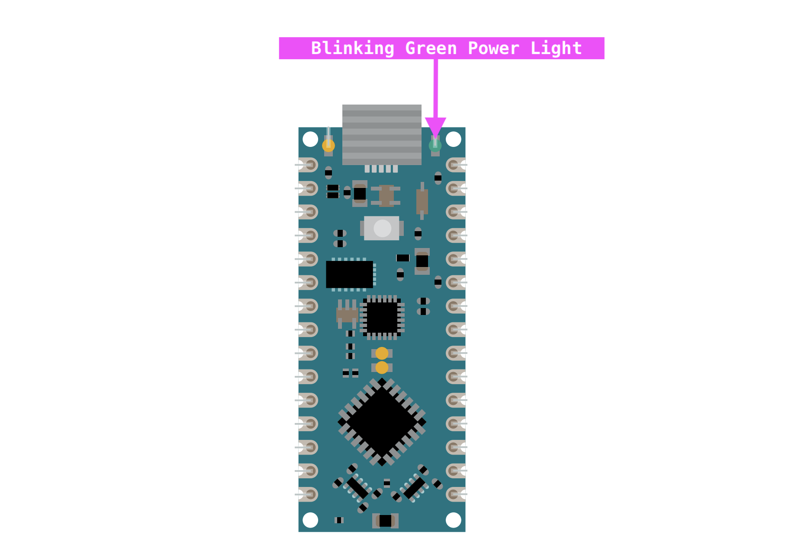
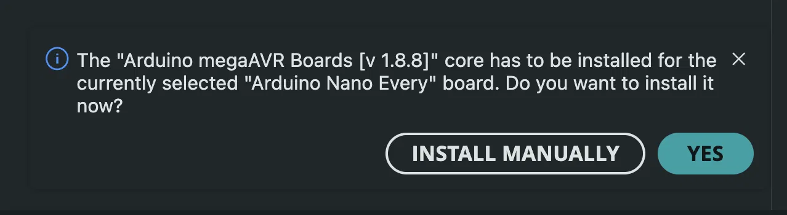

# Workshop Setup: Arduino Nano Every

Please complete this **before** the workshop. It takes about 15 minutes, most of which is downloading.

If you get stuck, skip to [Troubleshooting](#troubleshooting) at the bottom, or reach out ahead of time so we can sort it out before the session starts.

---

## What you need

- A computer running Windows, macOS, or Linux
- The Arduino Nano Every board
- The a microUSB cable and any adapters needed to connect to your laptop

---

## 1. Install and Open the Arduino IDE

Download **Arduino IDE 2.x** from [arduino.cc/en/software](https://www.arduino.cc/en/software).

Get the 2.x version, not Legacy 1.8.x.

### Windows

Run the `.exe` installer and accept the defaults. If Windows prompts you to approve driver installation, say yes.

### macOS

Open the `.dmg` and drag **Arduino IDE** into your Applications folder. Launch it from Applications, not from the mounted disk image.

On first launch macOS may warn that the app can't be verified. Go to **System Settings > Privacy & Security**, scroll down, and click **Open Anyway**.

### Linux

Download the **AppImage** from the Arduino site. Then make it executable and run it:

```
chmod +x arduino-ide_*.AppImage
./arduino-ide_*.AppImage
```

> Avoid the Snap and Flatpak builds. They're sandboxed and often can't reach the serial port, which produces confusing failures later. The AppImage is the reliable option.

**You also need serial port access.** Run this once:

```
sudo usermod -a -G dialout $USER
```

Then **log out and log back in**. A new terminal window is not enough, the group change only applies to a fresh login session. Skipping this is the most common Linux problem, and it shows up as a permission error at upload time rather than anything obvious now.

Verify it worked:

```
groups
```

You should see `dialout` in the list.

---

## 2. Install the board core

This is the step people skip. Nothing works without it.

1. Open the Arduino IDE
2. Click the **circuit board icon** (second icon down in the left sidebar), or go to **Tools > Board > Boards Manager**
    

3. Search for `megaAVR`. Find **Arduino megaAVR Boards** and click **Install**
    

4. Wait for it to finish. It's a few hundred MB and can take several minutes.

> You do **not** need "Arduino AVR Boards." That's a different core for a different board.

---

## 3. Connect the Board to Laptop
Connect the microUSB cable to your laptop. You may need to "allow" this accessory to be connected.

**Must be a data transfer cable.** Many cables are charge-only and carry no data. They look identical to good ones. If you're having issues with your laptop recognizing the board, this is the most likely reason.

You should see a green power LED come on. Other orange LED lights (solid or blinking) are also normal.


---

## 4. Select the board

Open the dropdown at the top of the IDE window (it says "Select Board").

You should see **Arduino Nano Every** listed with a port beside it:

| Platform | Port looks like |
|---|---|
| Windows | `COM3`, `COM7`, etc. |
| macOS | `/dev/cu.usbmodem101` |
| Linux | `/dev/ttyACM0` |

Click it.

*If the IDE offers to install the megaAVR core (should have installed before), click **Yes**.*


That's it. You're set up!

---

## Troubleshooting

### No board appears in the dropdown

In order of likelihood:

1. **Try a different USB-C cable.** This fixes it most of the time.
2. **Try a different USB port** on your computer.
3. **Plug directly into the computer,** not through a hub or dongle.

### Windows: shows as "Unknown device" or an unnamed COM port

Open Device Manager (right-click the Start button > Device Manager) and expand **Ports (COM & LPT)**.

If you see a yellow warning triangle, right-click that entry and choose **Update driver > Search automatically for drivers**.

### macOS: nothing appears in the dropdown

Open Terminal and run this with the board plugged in:

```
ls /dev/cu.*
```

If you see something containing `usbmodem`, your Mac can see the board and the IDE just has a stale port list. Quit the IDE completely with **Cmd+Q** (closing the window isn't enough) and reopen it.

If you see no `usbmodem` entry, it's the cable. Swap it.

### Linux: permission denied, or "can't open device /dev/ttyACM0"

You're not in the `dialout` group, or you haven't logged out since adding yourself. Run:

```
groups
```

If `dialout` isn't listed, go back to the [Linux install section](#linux) and log out and back in afterward.

### Linux: nothing appears in the dropdown

Check whether the kernel sees the board at all:

```
ls /dev/ttyACM*
```

If `/dev/ttyACM0` exists, the board is fine and it's a permissions or IDE issue. Restart the IDE.

If nothing is there, run `dmesg | tail -20` right after plugging in. No new USB messages means it's the cable.

If you installed via Snap or Flatpak, that's likely the cause. Switch to the AppImage.

### The board list is empty, or says "No boards found"

The core didn't install. Go back to [step 2](#2-install-the-board-core).

### Upload fails with a red error

1. Close the Serial Monitor if it's open, then try again
2. Unplug the board, plug it back in, reselect the port, retry
3. Quit and reopen the IDE

### Something else

Ask us for help and we'll see if we can get you working!
