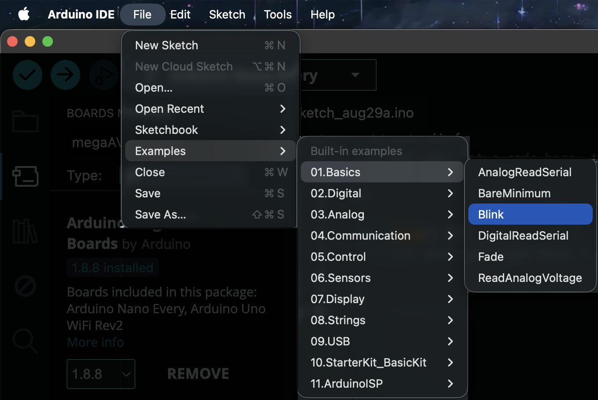
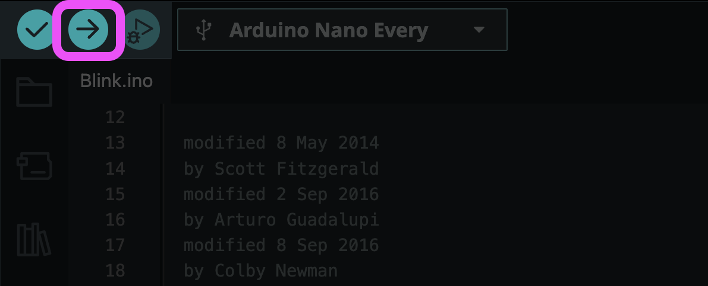

# First Test: Blink Rate

Blink is the "hello world" of Arduino. It's worth uploading to any new board first, since a successful upload confirms the whole chain is working before you write anything real.

## Main Test
*Arduino IDE has quite a few "built in" sketches that you can quickly run without changing the code.*

1. Go to **File > Examples > 01.Basics > Blink**


2. Click the **arrow button** (Upload) to compile and send the sketch to the board. This will compile and upload the code to the board, where it starts running immediately.


3. Watch the console at the bottom of the window

**Success:** the console says `Done uploading.` and the orange LED next to the USB port blinks steadily, once per second.

<video src="images/movies/blink_rate.mov" autoplay loop muted playsinline></video>

## Understanding The Code

Every Arduino sketch has two required functions:

### `setup()`
```cpp
void setup() {
  pinMode(LED_BUILTIN, OUTPUT);
}
```
Runs **once** when the board powers on or resets. Here it configures the built-in LED pin as an **output** so the board can send voltage to it.

### `loop()`
```cpp
void loop() {
  digitalWrite(LED_BUILTIN, HIGH);
  delay(1000);
  digitalWrite(LED_BUILTIN, LOW);
  delay(1000);
}
```
Runs **repeatedly forever** after `setup()` finishes. Each cycle:

1. `digitalWrite(LED_BUILTIN, HIGH)` — sets the pin to high voltage, which turns the LED **on**
2. `delay(1000)` — pauses for 1000 milliseconds (1 second)
3. `digitalWrite(LED_BUILTIN, LOW)` — sets the pin to 0V, turning the LED **off**
4. `delay(1000)` — pauses another second, then the loop repeats

### Key terms
| Term | Meaning |
|------|---------|
| `LED_BUILTIN` | A constant for the onboard LED pin (pin 13 on most Uno boards) |
| `HIGH` / `LOW` | The two voltage states: on and off |
| `delay(ms)` | Blocks execution for the given number of milliseconds |

## Uplevel - Challenge Yourself with these Exercises
Want to challenge yourself to see if you understand the code in here? Try these challenges!

1. The light is turning on and off every second. How can we make the light blink faster? Slower?
2. How can we keep the light on for 5 seconds and turn off for 1 second?
3. How fast can you make it blink before it stops looking like it's blinking?
4. Can you make the LED blink SOS in Morse code? (dot = short blink, dash = long blink: ··· ——— ···)
5. Can you create a heartbeat pattern — two quick blinks close together, then a long pause?
