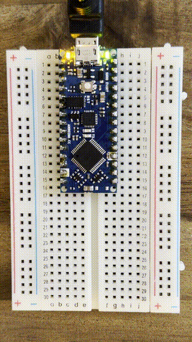

# It Has a Pulse

The Blink sketch is the "hello world" of Arduino. A steady blink is proof of life. It means the board is alive and responding. Think of it as giving your creature a pulse.

## Main Test
*Arduino IDE has quite a few "built in" sketches that you can quickly run without changing the code.*

1. To open the blink test, go to **File > Examples > 01.Basics > Blink**


2. Right now, the code only lives in your laptop and we need it to be "uploaded" to the Arduino Nano so that the Nano can run the code. Click the **arrow button** (Upload) to send the sketch to the board. This will compile and upload the code to the board, where it starts running on the Nano immediately.


3. Watch the console at the bottom of the window to make sure the upload was successful.

**Success:** the console says `Done uploading.` and the orange LED next to the USB port blinks steadily, once per second (which is what the blink test does).

> Unsuccessful? Try quitting Arduino IDE, unplug the Nano from your computer, and wait a few seconds. Then reopen Arduino IDE and plug the Nano back in. Typical "have you tried shutting it down and restarting it?" vibes, but it often works! If it doesn't, head to [Troubleshooting](../1_installation/Troubleshooting.md) for help!



## Understanding The Code

Every Arduino sketch has two required functions:

### `setup()`
```cpp
void setup() {
  pinMode(LED_BUILTIN, OUTPUT);
}
```
Runs **once** when the board powers on or resets. Pin modes (i.e. input or output) are usually defined in setup to tell the Nano what to listen and respond to. Here it configures the built-in LED pin as an **output** so the board can send voltage to it.

### `loop()`
```cpp
void loop() {
  digitalWrite(LED_BUILTIN, HIGH);
  delay(1000);
  digitalWrite(LED_BUILTIN, LOW);
  delay(1000);
}
```
Runs **repeatedly "forever"** after `setup()` finishes. Here we see:

1. `digitalWrite(LED_BUILTIN, HIGH)` - sets the pin to high voltage, which turns the LED **on** (HIGH Voltage = ON in this case)
2. `delay(1000)` - pauses for 1000 milliseconds (1 second)
3. `digitalWrite(LED_BUILTIN, LOW)` - sets the pin to 0V, turning the LED **off**
4. `delay(1000)` - pauses another second, then the loop repeats

### Key terms
| Term | Meaning |
|------|---------|
| `LED_BUILTIN` | A constant for the onboard LED pin (this is to the right of the microUSB port) |
| `HIGH` / `LOW` | The two voltage states: on and off |
| `delay(ms)` | Pauses for the given number of milliseconds before moving on |

## Uplevel - Challenge Yourself with these Exercises
Want to challenge yourself to see if you understand the code in here? Try these challenges!

1. The light is turning on and off every second. How can we make the light blink faster? Slower?
2. How can we keep the light on for 5 seconds and turn off for 1 second?
3. How fast can you make it blink before it stops looking like it's blinking?
4. Can you make the LED blink SOS in Morse code? (dot = short blink, dash = long blink: ··· --- ···)
5. Can you create a heartbeat pattern - two quick blinks close together, then a long pause?

You've completed the first task of giving this creature a heartbeat! Now, let's get this creature aware and responsive to its surroundings!

Head to the next section: [It Sees](../3_it_sees/Instructions.md)
