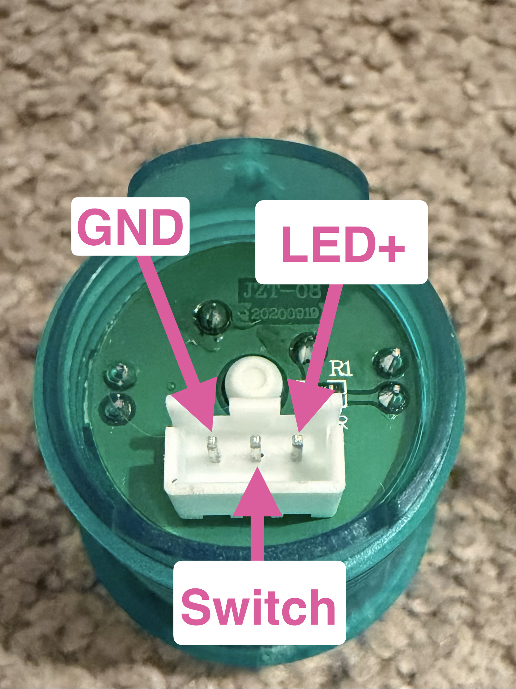
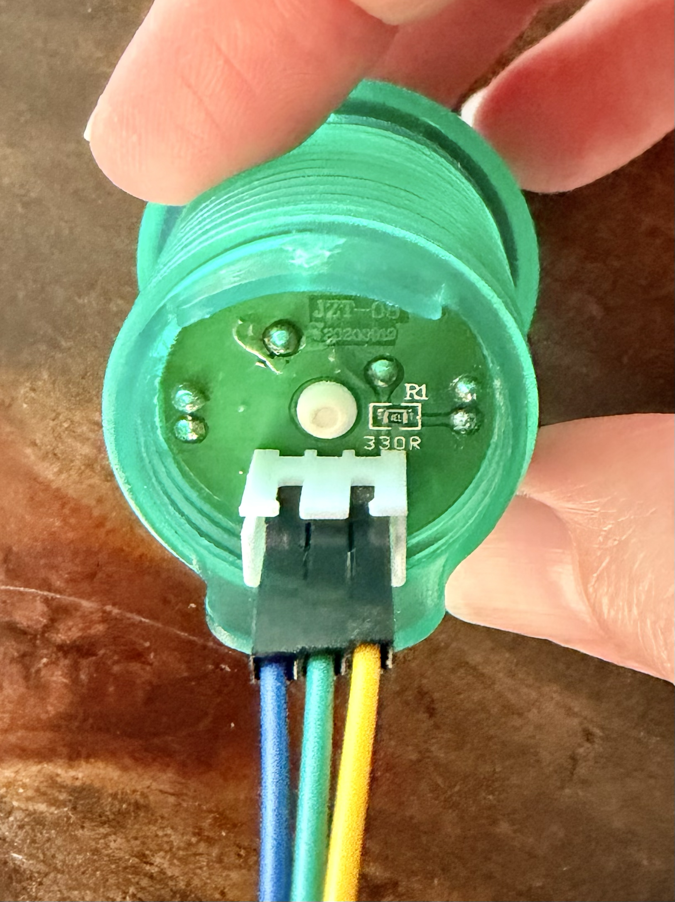
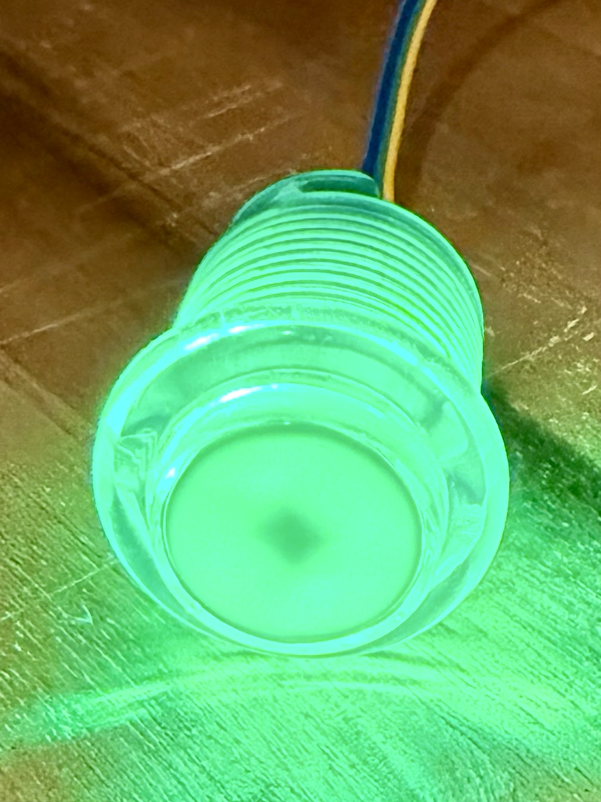
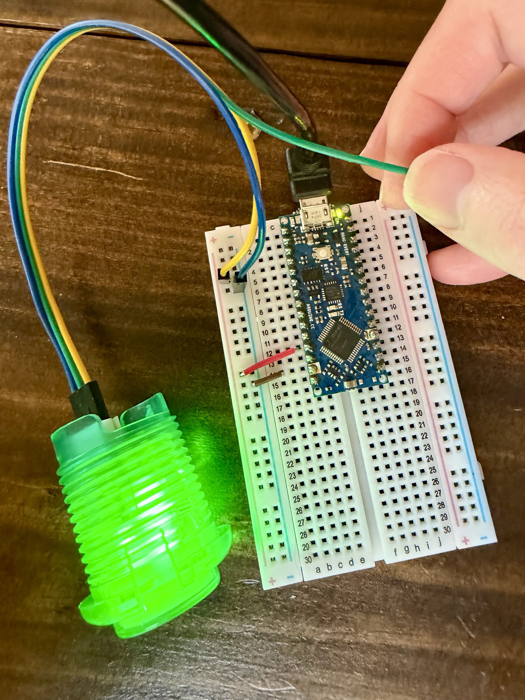
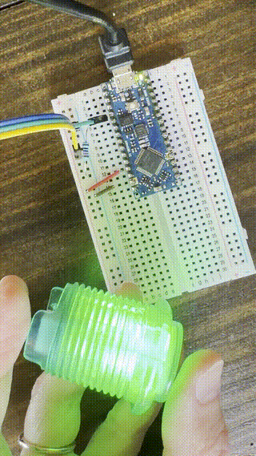
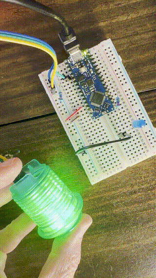

# It Sees

Now that the creature has a pulse, let's give it the ability to "see" (aka, flash a light on command). We'll connect a button for input, use the Nano's built-in LED and an external LED for output to be its "eyes".

Find the baggie labeled **"3_it_sees"** and use the components inside for this section.

## Step 1: Connecting the Button

The button has three prongs. Take the group of three female-to-male jumper wires and plug the female ends into the button prongs.


With the white port of the button facing down, take the group of male-to-female jumper wires and plug them into the following (don't pull the three wires apart, please!):
- **Blue** wire → **ground** prong
- **Green** wire → **switch** prong
- **Yellow** wire → **LED positive** prong

> You can technically use any wire for these three prongs, but to keep everyone consistent in this workshop, we're plugging it up this way.

## Step 2: Light Up the Button

Now let's power the button's built-in LED.

1. Plug the **blue** (ground) male end into any pin on the **left blue ground rail**

2. Plug the **yellow** (LED positive) male end into any pin on the **red power rail**

The button should light up!




## Step 3: Reading Button Presses

Right now, the button lights up, but it doesn’t actually do anything when it is pressed. Let’s connect the button’s switch so the Arduino can detect when it’s pressed.

### Wiring

First, we must connect the resistor. The resistor keeps the button’s signal reliably LOW when it isn’t pressed. It also prevents too much current from flowing when the button is pressed.

>>>**Important!!!**
>>>**Unplug the Nano before changing the breadboard when using resistors.**
>>>Otherwise, you might get a little shock (pun intended).


>>>**Also Important!!!**
>>>If you see anything smoking, immediately **unplug the Nano from your computer.**

1. Find the 10 kΩ resistor (it is the blue resistor with 5 bands: it has a brown band on each side of the resistor)
2. Put one end of the resistor on **left row 4** (4a, 4b, or 4c)
3. Put the other end of the resistor into any pin on the **left blue ground rail**

With the resistor in place, we are ready to connect the button to our pin!

4. Plug the **green** (switch) male end into **left row 4** on the breadboard (4a, 4b, or 4c - whichever is not taken up by the resistor you previously inserted)

Remember, Row 4 on the breadboard connects to digital pin 3 on the Nano — this is the pin we’ll read in code to detect button presses.

### Code changes

5. Open a new sketch: **File > New Sketch**

6. At the very top, define the pin numbers:

```cpp
const int BUTTON = 14; // Row 4, left
```

These are variables that give readable names to our pin numbers. `const int` means the value won’t change. It’s good practice to add pin numbers to the top because it’s easy to change and easy to have a quick reminder of where your pins should go!

7. In `setup()`, add the following:

```cpp
void setup() {
  // INPUT means this pin receives a signal
  // Reads LOW when released, HIGH when pressed
  pinMode(BUTTON, INPUT);
  pinMode(LED_BUILTIN, OUTPUT); // Same as Blink sketch
}
```

8. In `loop()`, add the following:

```cpp
void loop() {
  // When the button is read as `HIGH`, this means the button is `pressed`
  bool pressed = digitalRead(BUTTON) == HIGH;

  // If pressed is true, turn the LED on; otherwise, turn it off
  digitalWrite(LED_BUILTIN, pressed ? HIGH : LOW);
}
```

9. Upload the sketch to the board

Click the "upload" (->) button on Arduino IDE and wait for the code to be verified and uploaded to the Arduino.

When you press the button, the built-in LED on the Nano should turn on. When you release it, the LED should turn off.

### Complete code

```cpp
const int BUTTON = 14; // Row 4, left

void setup() {
  // INPUT means this pin receives a signal
  // Reads LOW when released, HIGH when pressed
  pinMode(BUTTON, INPUT);
  pinMode(LED_BUILTIN, OUTPUT);
}

void loop() {
  // When the button is read as `HIGH`, this means the button is `pressed`
  bool pressed = digitalRead(BUTTON) == HIGH;

  // If pressed is true, turn the LED on; otherwise, turn it off
  digitalWrite(LED_BUILTIN, pressed ? HIGH : LOW);
}
```



We have the first eye of our creature completed!

## Step 4: Adding an External LED

Let's give our creature a second eye so that it can have some improved depth perception!

We will add an external LED so both the built-in and external LEDs light up when the button is pressed.

### Components

- One standard two-legged LED
- One **220 Ω, ¼-watt resistor** (blue resistor with 6 bands: red, red, blue, black, and brown bands)
- Jumper wire

### Wiring

The 220 Ω resistor limits the current through the external LED, protecting both the LED and the Nano's D2 output.

> **LED tip:** The long leg is positive (+). The short leg is negative (–). The flat edge on the LED casing also marks the negative side.

1. Place the LED so its **long leg (+)** is in **right row 20** (any of f–j) and its **short leg (–)** is in **right row 23** (any of f–j)

2. Connect one end of the **220 Ω resistor** to **right row 20** (the LED's long leg), and the other end to **right row 11** (11h, 11i, or 11j) — this connects it to the Nano's D2 pin

3. Connect a short male-to-male jumper wire from **right row 23** (the LED's short leg) to any pin on the **left blue ground rail**

> The resistor can face either direction — resistors aren't directional.

### Code changes

4. Add the external LED pin at the top, below your `BUTTON` line:

```cpp
const int BUTTON = 14; // Row 4, left
const int EXTERNAL_LED = 2; // D2
```

5. In `setup()`, add a new `pinMode()` for the external LED:

```cpp
void setup() {
  pinMode(BUTTON, INPUT);
  pinMode(LED_BUILTIN, OUTPUT);
  pinMode(EXTERNAL_LED, OUTPUT); // D2 will control the external LED
}
```

6. In `loop()`, add a `digitalWrite()` for the external LED:

```cpp
void loop() {
  // With our pulldown wiring, HIGH means pressed.
  bool pressed = digitalRead(BUTTON) == HIGH;

  // Make both LEDs mirror the button state.
  digitalWrite(LED_BUILTIN, pressed ? HIGH : LOW);
  digitalWrite(EXTERNAL_LED, pressed ? HIGH : LOW);
}
```

7. Upload the sketch to the board

Now when you press the button, both the built-in LED and the external LED should turn on!

### Complete code

```cpp
const int BUTTON = 14;
const int EXTERNAL_LED = 2;

void setup() {
  pinMode(BUTTON, INPUT);
  pinMode(LED_BUILTIN, OUTPUT);
  pinMode(EXTERNAL_LED, OUTPUT);
}

void loop() {
  // With our pulldown wiring, HIGH means pressed.
  bool pressed = digitalRead(BUTTON) == HIGH;

  // Make both LEDs mirror the button state.
  digitalWrite(LED_BUILTIN, pressed ? HIGH : LOW);
  digitalWrite(EXTERNAL_LED, pressed ? HIGH : LOW);
}
```



Your creature can see! Notice how both eyes light up at the same time when you press the button, even though they're different colors (heterochromia is a feature, not a bug). That's because they share the same condition (`pressed`).

## Cleanup

Before moving on to the next section:

1. **Unplug the Nano from your computer**
2. Remove the LED, both resistors, the button, and all jumper wires **except** the red and brown wires that were already on the breadboard when you started (those connect to 5V and GND)
3. Leave the Nano plugged into the breadboard
4. Put everything you removed back into the baggie labeled **"3_it_sees"**

