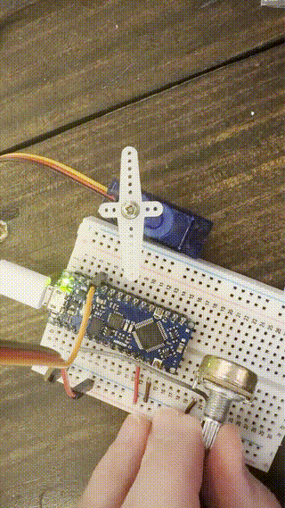

# It Moves

Now that the creature can see, let's give it the ability to move! We'll use a potentiometer (a dial) to control how fast a servo motor sweeps back and forth where turning the knob speeds up or slows down the sweep.

Find the baggie labeled **"4_it_moves"** and use the components inside for this section.

## What a servo is

A regular motor only knows one thing: spin while power is applied. It has no idea where it is or where it's been.

A servo is a small motor with three extra parts bolted on: gears to slow it down and give it strength, a sensor that tracks the exact position of the output shaft, and a tiny controller comparing the two. You don't tell a servo to spin. You tell it an **angle**, and it figures out which way to turn and how far, moves there, and then holds that position against anything pushing back.

That's why it has three wires instead of two. Red and brown are power and ground, same as anything else. The orange one is **signal**, and it carries the angle you want, not power. The servo does the actual work of getting there.

Most hobby servos, including this one, sweep across about 180 degrees rather than spinning freely. This one is doing the creature's twitching for us.

## Step 1: Wiring the Servo and Potentiometer

**Unplug the Nano from your computer before starting.**

### Components

- One servo motor
- One potentiometer
- Jumper wires

### Wiring

The red and brown jumper wires from earlier are already connecting the Nano's 5V and GND to the power rails. Both the servo and potentiometer will share those.

The servo has three wires. Take the group of three male-to-male jumper wires and connect them to the servo if they aren't already (don't pull the three wires apart, please!). Try to match the jumper wire colors to the servo wire colors:

- **Brown** jumper → servo's **GND** (brown) wire
- **Red** jumper → servo's **VCC** (red) wire
- **Orange** jumper → servo's **Signal** (orange) wire

> If you can't match colors (you only have so many wires), that's fine. Just remember which jumper connects to which servo wire.

Now plug the male ends into the breadboard on the **right side** near pin D9:

1. **Orange** (signal) → **right row 4** (4i or 4j), the row aligned with **pin D9**
2. **Red** (VCC) → **left row 12** (12a or 12b), straight into the Nano's **5V** pin (you could do it on the red rail, but I've found it doesn't give you enough power)
3. **Brown** (GND) → any pin on the **left blue (–) ground rail**

Notice that the servo's power does **not** go to the red rail, even though everything else does. Servos are greedy. A motor pulls a big gulp of current every time it starts moving, and the trip out to the rail and back costs a little voltage along the way. Normally that loss is too small to care about. With a servo yanking on the other end, it's enough to make the servo stutter, click, or stop entirely. Plugging it straight into row 12 puts it right next to the source.

Ground still goes to the rail, and that's fine. Row 12 is on the **left** side, the same side as the rails you've been using. The right-side rails aren't connected to anything, so reach your ground wire over to the left. Creating life is hard work. 🫣

> If you wanted the right rails to work, you'd run a jumper wire from the left red rail to the right red rail, and another from the left blue rail to the right blue rail (or the right GND pin on the nano which is row 12). That bridges the two sides so they share the same power and ground.

Next, place the potentiometer on **column d or e** with its top leg in **row 20**, middle leg in **row 22**, and bottom leg in **row 24**. It's common to put the potentiometer in backwards (knob facing away from the breadboard) so the knob is easier to reach and turn.

4. **Top outer leg** (row 20) → use the tiny brown jumper wire from its row to the **left blue (-) ground rail**
5. **Bottom outer leg** (row 24) → use the little red jumper wire from its row to the **left red (+) power rail**

It doesn't matter which outer leg goes to which rail. Swapping them just reverses which direction the knob turns.

6. **Middle leg** (row 22, the wiper) → use the grey jumper wire from its row to **left row 4** (4a, 4b, or 4c), the Nano's **A0** pin

### Code changes

7. Open a new sketch: **File > New Sketch**

8. At the very top, include the Servo library and define your variables:

```cpp
#include <Servo.h>

Servo myServo;      // servo object to control the shaft
int potPin = A0;    // potentiometer wiper connected here
int pos = 90;       // current servo angle, starts at center
int direction = 1;  // +1 = sweeping up, -1 = sweeping down
```

`#include <Servo.h>` pulls in Arduino's built-in Servo library, which handles all the timing signals the servo needs. `Servo myServo` creates a servo object we can control. `pos` tracks the current angle, and `direction` controls whether the servo is sweeping up or down.

Notice that `potPin` is set to `A0` - in *It Sees*, we used the same physical pin but called it `14`, its digital pin number. That's because the button only needed **digital** input: on or off, HIGH or LOW. The potentiometer is an **analog** input - it outputs a variable voltage, and `analogRead()` converts that to a value from 0 to 1023, giving us a full range instead of just on/off. When you want to read analog values, use the `A0`–`A7` names. Note that `A0` here refers to the pin labeled **A0 on the Nano itself** - it does not mean the A0 spot on the breadboard.

9. In `setup()`, attach the servo to its pin:

```cpp
void setup() {
  myServo.attach(9); // servo signal wire on pin 9
}
```

10. In `loop()`, read the potentiometer, calculate a speed, and sweep the servo:

```cpp
void loop() {
  int potValue = analogRead(potPin);   // read pot, 0-1023

  // Convert pot reading to a 0.0-1.0 range
  float t = potValue / 1023.0;

  // Exponential curve: at t=0, delay = 40ms (slow sweep)
  // at t=1, delay = 40 * 0.095 = ~4ms (fast sweep)
  // This feels more even across the knob's full turn than a linear map
  int stepDelay = 40 * pow(0.095, t);

  // Move one degree in the current direction
  pos += direction;

  // Hit an end stop? Reverse direction so it bounces back
  if (pos >= 180 || pos <= 0) {
    direction = -direction;
  }

  myServo.write(pos);   // send the new angle to the servo
  delay(stepDelay);     // wait before the next step (controls speed)
}
```

Instead of mapping the potentiometer directly to an angle, this code makes the servo sweep back and forth on its own. The potentiometer controls how fast it sweeps - all the way down is a slow sweep, all the way up is very fast. The exponential curve (`pow(0.095, t)`) makes the speed feel more even across the knob's full turn than a simple linear map would.

11. Upload the sketch to the board

The servo should start sweeping back and forth. Turn the potentiometer knob to control the speed!

> **Servo tip:** When a servo has no power, you should be able to gently turn its shaft by hand. The moment it has power, even if it's not actively moving, the shaft locks in place and resists. If you can still freely move it after powering up, the servo is likely broken.

### Complete code

```cpp
#include <Servo.h>

Servo myServo;      // servo object to control the shaft
int potPin = A0;    // potentiometer wiper connected here
int pos = 90;       // current servo angle, starts at center
int direction = 1;  // +1 = sweeping up, -1 = sweeping down

void setup() {
  myServo.attach(9); // servo signal wire on pin 9
}

void loop() {
  int potValue = analogRead(potPin);   // read pot, 0-1023

  // Convert pot reading to a 0.0-1.0 range
  float t = potValue / 1023.0;

  // Exponential curve: at t=0, delay = 40ms (slow sweep)
  // at t=1, delay = 40 * 0.095 = ~4ms (fast sweep)
  // This feels more even across the knob's full turn than a linear map
  int stepDelay = 40 * pow(0.095, t);

  // Move one degree in the current direction
  pos += direction;

  // Hit an end stop? Reverse direction so it bounces back
  if (pos >= 180 || pos <= 0) {
    direction = -direction;
  }

  myServo.write(pos);   // send the new angle to the servo
  delay(stepDelay);     // wait before the next step (controls speed)
}
```



## Stuck? Try the debugger

There's an optional sketch in this section's `code_example/` folder called **`debugger.ino`**. It does the same thing as the code above, but it also prints the knob reading, the calculated delay, and the angle the servo is being told to hold.

You can't see inside a running Arduino, so when something misbehaves it's hard to tell whether your wiring is wrong, your code is wrong, or a component is dead. The debugger makes the board tell you what it's seeing.

1. Open `debugger.ino` and copy + paste its contents into a new sketch
2. Upload it
3. Go to **Tools > Serial Monitor**

> **Close the Serial Monitor before you upload again.** It holds the connection to the board, and uploading needs that same connection. They can't both have it, so an upload with the monitor open may hang or fail.

The bottom of `debugger.ino` lists what common symptoms usually mean.

## Cleanup

Before moving on to the next section:

1. **Unplug the Nano from your computer**
2. Remove the servo, potentiometer, and all jumper wires **except** the red and brown wires that connect to 5V and GND
3. Leave the Nano plugged into the breadboard
4. Put everything you removed back into the baggie labeled **"4_it_moves"**

Head to the next section: [It Speaks](../5_it_speaks/Instructions.md)
