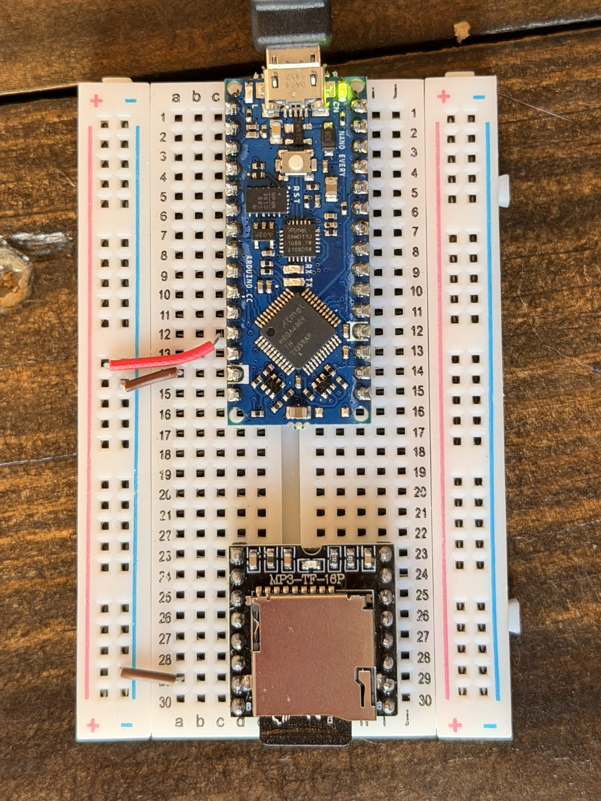
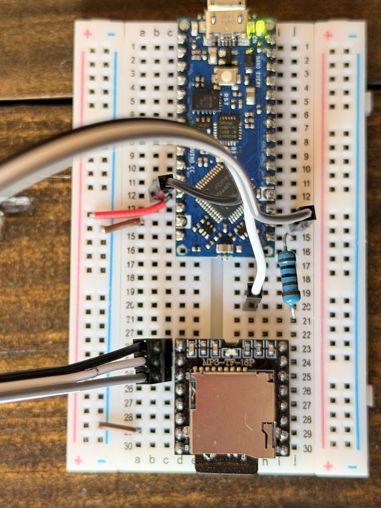
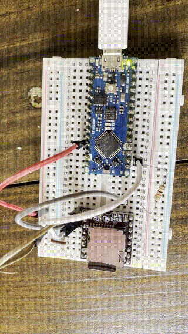
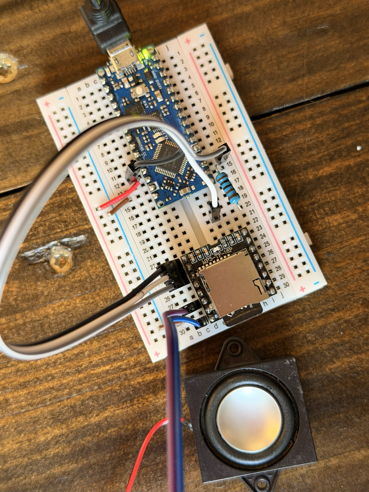
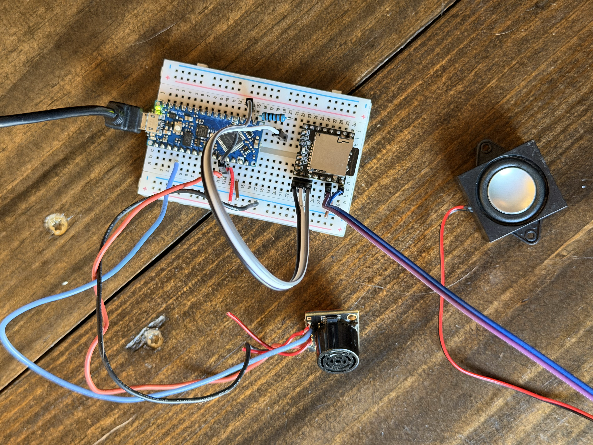

# It Speaks

Time to give the creature a voice. We'll wire up an MP3 player, a speaker, and a distance sensor, so that when you "wave" to your creature, it talks to you!

There's a reason this one is last. It uses more components and draws more power than anything we've built so far, and every part has to cooperate at once. When something in a circuit this size misbehaves, staring at the wires doesn't help much. So we're also going to use the Arduino's built-in logging system, called the **Serial Monitor**, to see what the board is actually thinking.

Fair warning: your creature will either refuse to say a word, or refuse to shut up. Welcome to TRUE hardware hookups and be ready to regret bringing this creature to life! 😈 Be prepared to be frustrated and that's okay!!

Find the baggie labeled **"5_it_speaks"** and use the components inside for this section.

## Step 1: Move the power down the board

**Unplug the Nano from your computer before starting.**

Up to now, a tiny red jumper wire has carried 5V from the Nano to the top of the red power rail, and it's been fine. It *probably* won't be fine anymore.

The MP3 player is the hungriest thing we've built, though the servo in the last section may come in a close second. It doesn't sip power steadily like an LED, it grabs a chunk every time it starts a sound. Power has to travel from the Nano, up into the rail, and all the way down the board to reach it, and every spring contact along that path adds a tiny bit of resistance. Individually they're nothing. Added up, with the MP3 player yanking on the other end, the voltage sags just enough to make it misbehave.

The fix is to stop making the power travel so far. We'll feed the rail down near where the new components actually live.

> If your station starts acting strange later in this section, this is the first thing to suspect. Move around the 5V wires to different holes in the rail and see if it settles down.

1. "Roll" the tiny red jumper wire connecting the Nano's 5V to the red rail down so that we can access the 12a and 12b pins
2. If rolling doesn't work, feel free to remove the red wire and put it back in the baggie because we won't be using it anymore

## Step 2: Place the MP3 player

The MP3 player is a small board called a **DFPlayer Mini**. It reads audio files off a microSD card and has a tiny amplifier built into it.

1. Find the DFPlayer Mini in your baggie
2. Place it so the **microSD card slot faces the bottom** of the breadboard
3. Seat it with the **bottom-left pin in 30c**, straddling the center channel. You may have to gently press the pins on the DFPlayer Mini together to get it in. If you're struggling with getting it pushed iny, ask Nessa to help
4. Take the **tiny brown jumper wire** and connect **29a** to the **blue (-) ground rail**. This gives the DFPlayer a shared ground with the Nano.

The microSD card is already loaded with your creature's voice and inserted in the slot. Leave it alone.



> Want your creature to say something of your own later? See [Loading Your Own Audio](Loading_Your_Own_Audio.md) for how to format a card, convert your files, and get them on there. There are a few traps in that process, and they're all written down.

Now connect the DFPlayer Mini with the Arduino:

5. Take out the group of three **male-to-male jumper wires** (you should have a group of 3 and a group of 2 male-to-male jumper wires)
6. Keeping the group of three together without breaking them apart, take the Black wire and put one end into 12b and the other in 23c. This is sending the 5V current to the DFPlayer.
7. Put the grey wire into 14j or 14i and the other end into 25c.

## Step 3: Let the Nano talk to the MP3 player

The Nano and the DFPlayer are going to have a conversation, so they each need a wire for talking and a wire for listening.

### Components

- One blue resistor with **brown, black, and red** bands (1kΩ)
- One male-to-male jumper wire (the **white** wire from the group of three)

### Wiring

**Unplug the Nano if it isn't already.**

1. Put one leg of the **brown-black-red resistor** in **row 20 (f-j)**, and the other leg in **row 15, i or j**
2. Run the **white** wire from **row 20 (f-j)** to **24c**



### Why the resistor?

The DFPlayer's RX pin can protect itself from the Nano's 5V, but only if something limits the current. That's the resistor's job. It goes on the wire where the Nano talks, and direction doesn't matter.

### Code changes

5. If you didn't install the DFPlayer library during setup, do it now: go to **Tools > Manage Libraries**, search for `DFRobotDFPlayerMini`, and install the one by **DFRobot**. There are similarly named libraries by other authors that will not work.

6. Open a new sketch: **File > New Sketch**

7. At the very top, include the library and create a player object:

```cpp
#include <DFRobotDFPlayerMini.h>

DFRobotDFPlayerMini player;
```

`DFRobotDFPlayerMini player` creates an object we can send commands to, the same way `Servo myServo` did in *It Moves*.

8. In `setup()`, start the conversation and set the volume:

```cpp
void setup() {
  Serial1.begin(9600);   // the D0/D1 pins, where the DFPlayer is wired
  delay(2000);           // give the module time to wake up and read the card

  player.begin(Serial1);
  player.volume(25);     // 0 to 30
}
```

`Serial1` is the Nano's second communication channel, the one wired to pins D0 and D1. `begin(9600)` sets the speed both sides agree to talk at. The `delay(2000)` matters more than it looks: the DFPlayer needs a couple of seconds to power up and read the card, and asking it questions before it's ready is a good way to get nonsense.

`volume(25)` is worth knowing about. The range goes to 30, but 30 is the top of the range, not the top of the *good sounding* range. Most of these modules start distorting in the high twenties.

9. In `loop()`, play the file and wait:

```cpp
void loop() {
  player.playMp3Folder(1);   // plays 0001.mp3 from the mp3 folder
  delay(5000);               // wait 5 seconds, then do it again
}
```

10. Plug the Nano back into your computer and upload the sketch

You don't have a speaker yet, so you won't hear anything. Instead, **watch for the small blue LED on the DFPlayer**. It lights up while a track is playing. If it's blinking every five seconds, the Nano and the MP3 player are talking to each other and you're in good shape.

If the light never comes on, check that your D0 and D1 wires aren't swapped. Talking has to reach listening.



### Complete code

```cpp
#include <DFRobotDFPlayerMini.h>

DFRobotDFPlayerMini player;

void setup() {
  Serial1.begin(9600);   // the D0/D1 pins, where the DFPlayer is wired
  delay(2000);           // give the module time to wake up and read the card

  player.begin(Serial1);
  player.volume(25);     // 0 to 30
}

void loop() {
  player.playMp3Folder(1);   // plays 0001.mp3 from the mp3 folder
  delay(5000);               // wait 5 seconds, then do it again
}
```

## Step 4: Add the speaker

Now let's give your creature a voicebox (because surely we won't regret it...). You're going to hear your creature's first words into this world!

The speaker in your baggie is a **3 watt, 8 ohm** mini speaker. Those two numbers are worth knowing what to look for when you buy your own later. **Watts** is how much power it can handle before it complains. **Ohms** is its impedance, roughly how hard it is for the amplifier to push. Lower ohms means the amp has to work harder and pull more current.

1. Find the speaker in your baggie as we will now connect it to the DFPlayer Mini. Attach the group of 2 male-to-male jumper into the two female speaker connectors
2. On the other end, put one lead in **28c**
3. Put the other lead in **30c**

It genuinely doesn't matter which lead goes where in terms of if the blue or purple goes into which lead. A speaker works the same either way round.

Your creature should now be talking every five seconds. If the blue light blinks but you hear nothing, double-check that neither speaker wire slipped into **29**, which is ground.



## Step 5: Give it something to react to

Right now your creature is a very enthusiastic parrot. Let's make it respond to people (or cats that whack your creature, which they will be prone to do) instead.

> Fair warning: this sensor is the fussiest part of the workshop. It's sensitive to wiring, lighting, and placement, and we're not controlling any of those. If you can't get it to work reliably, that's okay! But let's see what we can do.

### What this thing is

The sensor in your baggie is an **ultrasonic rangefinder**. It works the way a bat does. It chirps a burst of sound too high for you to hear, listens for the echo bouncing back off whatever's in front of it, and times how long the round trip took. Sound travels at a known speed, so that time converts directly into distance.

What makes it interesting as an input is that it gives you a **number that changes smoothly**, not just on or off. Your button in *It Sees* could only tell you pressed or not pressed. This tells you how far away something is, continuously, so you get to decide in code what counts as "close enough."

### Wiring

**Unplug the Nano before you wire this.**

1. Find the ultrasonic rangefinder in your baggie. It looks like a tiny speaker with a board behind it with 5 tentacles (aka, wires) coming out of it. Note that these are not like our jumper wires, so you may need to twist the exposed wire to make it easier to push into the breadboard.
2. **Black wire** → the **blue (–) ground rail**
3. **Red wire** (second from the right on the sensor) → 12a
4. **Blue wire** → **4c**

Row 4 is the Nano's **A0** pin, the same analog input the potentiometer used in *It Moves*.

### Code changes

5. At the top, add your sensor pin and two thresholds:

```cpp
#include <DFRobotDFPlayerMini.h>

DFRobotDFPlayerMini player;

const int sensorPin = A0;
const int wakeReading  = 150;   // smaller number = closer
const int resetReading = 220;

bool creatureAwake = false;
```

Notice these are raw sensor readings, not inches. We don't actually need real distance. All the code does is compare against a threshold, so a number that reliably gets smaller as you get closer is enough. You'll tune these two numbers yourself in a minute.

`creatureAwake` is a flag that remembers whether the creature has already spoken.

6. Add a helper function that reads the sensor a few times and averages:

```cpp
int readSensor() {
  long total = 0;
  for (int i = 0; i < 5; i++) {
    total += analogRead(sensorPin);
    delay(10);
  }
  return total / 5;
}
```

Sensor readings jitter. A single noisy sample that happens to cross the threshold would set your creature off at random, which is maddening. Averaging five readings smooths that out.

7. In `setup()`, add the Serial Monitor:

```cpp
void setup() {
  Serial.begin(9600);    // the USB connection to your computer
  Serial1.begin(9600);   // the DFPlayer
  delay(2000);

  player.begin(Serial1);
  player.volume(25);

  Serial.println("Creature ready.");

  player.playMp3Folder(1);   // say hello as soon as it powers up
  creatureAwake = true;      // it just spoke, so wait for them to back away
}
```

The creature now greets you the moment it powers up, before anyone has come near it. This is useful to make sure the DFPlayer and speaker are working, even if the ultrasonic rangefinder isn't. Setting `creatureAwake` to `true` right after tells it that it has already spoken, so it won't immediately say the same thing again to whoever happens to be standing there. It waits until they back away and come back (though I find placing your hand moving above the sensor is a fairly reliable way to trigger it).

`Serial` and `Serial1` are two different channels. `Serial1` talks to the DFPlayer over D0 and D1. `Serial` talks to **your computer** over the USB cable, and that's the one whose messages you can read.

8. Replace `loop()` with this:

```cpp
void loop() {
  int reading = readSensor();
  Serial.println(reading);       // send the number to your computer

  if (reading < wakeReading && !creatureAwake) {
    player.playMp3Folder(1);
    creatureAwake = true;
  }
  if (reading > resetReading) {
    creatureAwake = false;
  }
  delay(50);
}
```

Look at the two thresholds. The creature wakes when you get closer than 150, but doesn't re-arm until you back off past 220. That gap is deliberate. If both numbers were the same, someone standing right at the boundary would retrigger the clip dozens of times a second and your creature would have a breakdown.

9. Plug the Nano back in and upload the sketch

### Opening the Serial Monitor

10. Go to **Tools > Serial Monitor**. A panel opens at the bottom of the window
11. Make sure the speed dropdown in the corner says **9600**. It has to match the number in `Serial.begin(9600)`, or you'll get gibberish

**Close the Serial Monitor tab before you upload again.** The Serial Monitor holds the USB connection open so it can listen, and uploading needs that same connection to send the new program. They can't both have it, so an upload attempted with the monitor open may hang or fail. Close the tab, upload, reopen it.



### Try it

Move your hand slowly toward the sensor and watch the numbers in the serial monitor stream past.

The numbers should **decrease as your hand gets closer** and increase as you pull away. They won't be inches or centimeters, and that's fine. What matters is that the number moves in a consistent direction.

Once you can see your own numbers, tune the sketch to your station: hold your hand where you want the creature to wake up, note the number, and put it in as `wakeReading`. Back off to where it should reset, note that number, and use it as `resetReading`.

### If something's not working

- **Numbers don't change at all** → check the blue wire is fully seated in 4c, and that the sensor's red and black wires reach the rails
- **Numbers change but there's no sound** → your thresholds are probably wrong for your setup. Watch the readings and pick numbers you actually see
- **It worked and then stopped** → try moving your 5V jumper to a different hole in the red rail. Breadboard rails can have bad spots, and a loose power connection looks exactly like a broken program
- **Nothing works and the blue light is off** → check power before anything else. Almost every mysterious fault in this section is a power connection

### Complete code

```cpp
#include <DFRobotDFPlayerMini.h>

DFRobotDFPlayerMini player;

const int sensorPin = A0;
const int wakeReading  = 150;   // smaller number = closer
const int resetReading = 220;

bool creatureAwake = false;

// Read the sensor five times and average, so a single
// noisy reading can't set the creature off by accident
int readSensor() {
  long total = 0;
  for (int i = 0; i < 5; i++) {
    total += analogRead(sensorPin);
    delay(10);
  }
  return total / 5;
}

void setup() {
  Serial.begin(9600);    // the USB connection to your computer
  Serial1.begin(9600);   // the D0/D1 pins, where the DFPlayer is wired
  delay(2000);           // give the module time to wake up and read the card

  player.begin(Serial1);
  player.volume(25);     // 0 to 30

  Serial.println("Creature ready.");

  player.playMp3Folder(1);   // say hello as soon as it powers up
  creatureAwake = true;      // it just spoke, so wait for them to back away
}

void loop() {
  int reading = readSensor();
  Serial.println(reading);       // send the number to your computer

  // Wake up when something gets close
  if (reading < wakeReading && !creatureAwake) {
    player.playMp3Folder(1);
    creatureAwake = true;
  }

  // Re-arm only after they back away, so it doesn't
  // retrigger over and over at the boundary
  if (reading > resetReading) {
    creatureAwake = false;
  }

  delay(50);
}
```

## Stuck? Try the debugger

There's an optional sketch in this section's `code_example/` folder called **`debugger.ino`**. It does the same thing as the code above, but it also reports whether the MP3 player answered, then streams the distance readings so you can pick your own threshold numbers.

You can't see inside a running Arduino, so when something misbehaves it's hard to tell whether your wiring is wrong, your code is wrong, or a component is dead. The debugger makes the board tell you what it's seeing.

1. Open `debugger.ino` and copy + paste its contents into a new sketch
2. Upload it
3. Go to **Tools > Serial Monitor**

> **Close the Serial Monitor before you upload again.** It holds the connection to the board, and uploading needs that same connection. They can't both have it, so an upload with the monitor open may hang or fail.

The bottom of `debugger.ino` lists what common symptoms usually mean.

## Cleanup

That's your creature. It has a pulse, it sees, it moves, and now it speaks.

1. **Unplug the Nano from your computer**
2. Push the microSD card in to pop it out of the DFPlayer, then remove the DFPlayer from the breadboard, then push the microSD card back into the DFPlayer
3. Remove the speaker, sensor, resistor, and all jumper wires
4. Put everything back into the baggie labeled **"5_it_speaks"**
5. Return **all baggies, wires, Nanos, micro USB cables, and adapters** to the front

If you want your creature to say something new once you have your own DFPlayer, [Loading Your Own Audio](Loading_Your_Own_Audio.md) walks through the whole card process.

If you want to keep playing and there is time left in the workshop, come up front. We've brought extra components to mess around with, and we're happy to help you try something.
